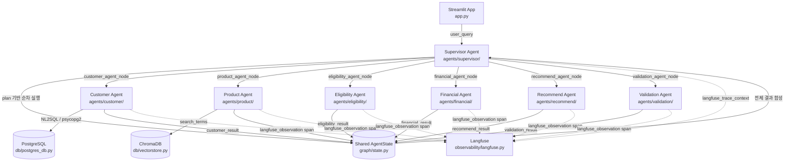

# PoCaT 컴포넌트 설계문서

> **현재 구현 기준** (2026-06-20)
> 실제 구현은 LangGraph shared-state 기반 Supervisor 통제형 순차 실행입니다.
> README의 "A2A" 표현은 설계 의도이며, 현재 코드에서는 agent 간 직접 통신이 없습니다.

---

## 1. 전체 아키텍처 개요

```
사용자 질의
    ↓
[Streamlit App]
    ↓ user_query
[Supervisor Agent] ← 실행 계획 수립 (task_type 판단, plan 생성)
    ↓ 순차 실행 (LangGraph Conditional Edge)
[Customer Agent] → PostgreSQL (NL2SQL)
    ↓
[Product Agent] → ChromaDB (RAG)
    ↓
[Eligibility Agent]
    ↓
[Financial Agent]
    ↓
[Recommend Agent]
    ↓
[Validation Agent]
    ↓ Rule + LLM 검증
[Supervisor Agent] ← synthesize_mode (최종 답변 합성)
    ↓ final_answer
[Streamlit App] → 사용자
```

모든 agent는 `AgentState`(TypedDict)를 공유하며, 자신의 결과를 `{agent}_result` 키에 저장합니다.

---

## 2. 컴포넌트 다이어그램



---

## 3. 컴포넌트별 책임 표

| Component | Responsibility | Input | Output | Main Files | Failure / Fallback |
|-----------|---------------|-------|--------|------------|-------------------|
| **Streamlit UI** | 사용자 입력 수신, 그래프 실행, 결과 표시 | 사용자 텍스트 입력 | `final_answer` 렌더링 | `app.py` | 그래프 예외 catch 후 에러 메시지 표시 |
| **Supervisor Agent** | task_type 판단, plan 수립, agent 순서 제어, 최종 답변 합성 | `user_query`, 전체 state | `plan`, `next`, `final_answer` | `agents/supervisor/agent.py` | validation 실패 시 `_build_validation_blocked_answer()` |
| **Customer Agent** | 고객 기본정보·계좌·납입이력 조회 및 파싱 | `state.member_id` 또는 `state.customer_id` | `customer_result.result.customer_profile` | `agents/customer/agent.py`, `agents/customer/tools.py` | DB 실패 시 `status=failed`, LLM 루프 fallback |
| **Product Agent** | RAG 기반 상품 약관 검색, 상품 후보 정규화 | `user_query`, (고객 정보) | `product_result.result.products` | `agents/product/agent.py`, `agents/product/tools.py` | RAG 비활성화·파싱 실패 시 `fallback_reason` 기록, `products=[]` |
| **Eligibility Agent** | 상품별 가입 가능 여부 판단, 우대조건 평가, 그룹화 | `customer_profile`, `product_candidates` | `eligibility_result.result.eligible_products` 등 | `agents/eligibility/agent.py`, `agents/eligibility/tools.py` | 프로필 부족 → needs_check 하향; 상품명 비정상 → invalid_product |
| **Financial Agent** | 이자·만기금액·갈아타기 손익 계산 | `product_candidates`, 금리·기간·금액 | `financial_result.result.calculations` | `agents/financial/agent.py`, `agents/financial/tools.py` | 계산 필드 부족 → `needs_check`, `missing_fields` 기록 |
| **Recommend Agent** | 우선순위 추천 목록 생성, 제외 사유 정리 | `eligibility_result`, `financial_result`, `product_candidates` | `recommend_result.result.recommendations` | `agents/recommend/agent.py` | financial 결과 없음 → `recommendation_deferred`; eligible 없음 → `no_eligible_product` |
| **Validation Agent** | Rule + LLM 이중 검증, blocking_issues 판단 | 전체 state (모든 agent 결과) | `validation_result.result.is_valid`, `blocking_issues` | `agents/validation/agent.py`, `agents/validation/tools.py` | Rule 검증 실패 → `status=failed`; 단순 task → Rule 검증만 |
| **RAG / Search** | 상품 약관 PDF 벡터 검색, 유사 발췌 반환 | `query: str` | 유사 약관 텍스트 | `db/vectorstore.py`, `agents/product/tools.py` | 검색 결과 없음 → 빈 문자열 반환 |
| **DB / NL2SQL** | PostgreSQL 고객 데이터 조회 (SELECT만 허용) | SQL 문자열 | 표 형식 텍스트 | `db/postgres_db.py`, `mcp_servers/postgres_mcp_server.py` | 연결 실패 → 예외 전파; 위험 SQL → 거부 |
| **Langfuse** | Agent 실행 span 기록, trace 관측 | span name, input, output, metadata | Langfuse 대시보드 trace | `observability/langfuse.py` | 키 미설정 → 자동 비활성화; 연결 실패 → `_LANGFUSE_INIT_FAILED=True`, 이후 무시 |

---

## 4. Agent별 Structured Output Schema 흐름

각 agent는 자신의 결과를 아래 키에 저장합니다. downstream agent는 이 키를 직접 읽습니다.

```
customer_agent    → state["customer_result"]["result"]["customer_profile"]
                        ↓
product_agent     → state["product_result"]["result"]["products"]
                        ↓
eligibility_agent → state["eligibility_result"]["result"]
                        ├─ eligible_products   (list)
                        ├─ needs_check_products (list)
                        └─ rejected_products    (list)
                        ↓
financial_agent   → state["financial_result"]["result"]["calculations"]
                        ↓
recommend_agent   → state["recommend_result"]["result"]["recommendations"]
                        ↓
validation_agent  → state["validation_result"]["result"]["is_valid"]
                        ↓
supervisor        → final_answer (최종 합성)
```

### 공통 agent result envelope

모든 agent의 결과는 아래 구조를 따릅니다 (`agents/base.py` `make_agent_result()`).

```json
{
  "status": "success | needs_check | fallback | failed | error",
  "summary": "LLM이 생성한 요약 텍스트",
  "result": {
    "summary": "...",
    "tool_results": [...],
    "...agent별 구조화 필드..."
  },
  "evidence": [...],
  "error": null
}
```

> `result` 안의 필드가 최상단에도 복사됩니다 (`make_agent_result()` 동작).
> downstream은 `result.X` 경로를 우선 사용하고, 없으면 최상단 `X`를 시도합니다.

---

## 5. 실행 흐름 상세 (LangGraph)

**`graph/builder.py`** 기준:

```
START
  └→ supervisor_node (plan_mode)
        └→ _supervisor_router()
              ├→ [task_type=casual]  → supervisor_node (synthesize_mode) → END
              └→ [첫 agent 이름]
                    └→ customer_agent_node
                          └→ _route_after("customer_agent")
                                └→ product_agent_node
                                      └→ _route_after("product_agent")
                                            └→ eligibility_agent_node
                                                  ...
                                                  └→ validation_agent_node
                                                        └→ supervisor_node (synthesize_mode)
                                                              └→ END
```

`_route_after(current)` 함수가 `state["plan"]`에서 다음 agent를 결정합니다. 계획에 없는 agent는 건너뜁니다.

---

## 6. Task Type별 표준 실행 계획

| Task Type | 실행 계획 |
|-----------|-----------|
| casual | Supervisor 직접 응답 (agent 없음) |
| customer_lookup | customer_agent |
| product_info | product_agent |
| financial_analysis | customer_agent → financial_agent → validation_agent |
| eligibility_check | customer_agent → product_agent → eligibility_agent → validation_agent |
| recommendation | customer_agent → product_agent → eligibility_agent → financial_agent → recommend_agent → validation_agent |
| early_termination | customer_agent → product_agent → financial_agent → recommend_agent → validation_agent |
| switch_analysis | customer_agent → financial_agent → product_agent → eligibility_agent → recommend_agent → validation_agent |

---

## 7. 현재 구현상 주의사항

1. **summary + structured result 이중 생성**: 각 agent는 LLM 응답 텍스트(`summary`)와 파싱된 구조화 결과(`result.{key}`)를 함께 생성해야 합니다. 어느 하나만 있으면 downstream에서 파싱 오류가 발생합니다.

2. **downstream은 structured key 우선 읽기**: downstream agent는 summary markdown을 재파싱하지 않고 `state["product_result"]["result"]["products"]` 같은 구조화 키를 우선 읽습니다. summary는 Supervisor의 최종 합성용입니다.

3. **상품명 검증 필수**: `product_agent` RAG 결과에서 약관 본문 문장이 `product_name`으로 들어가는 경우가 있습니다. `_normalize_product_candidate()`가 이를 방어하지만, eligibility_agent에서도 `invalid_product` 분류로 2차 방어합니다.

4. **financial_result.calculations 없으면 추천 보류**: `recommend_agent`는 `financial_result.result.calculations`가 비어있으면 `recommendation_deferred`를 반환하고 추천을 생성하지 않습니다.

5. **Langfuse metadata 최소화**: `update_observation()` 호출 시 state 전체를 넣지 않고 `fallback_reason`, source path, count, names 등 최소 필드만 기록합니다. state 전체 직렬화는 Langfuse 용량 초과와 민감정보 노출 위험이 있습니다.

---

## 확인한 주요 코드 위치

- [app.py](../app.py) — Streamlit UI 진입점
- [graph/builder.py](../graph/builder.py) — LangGraph 그래프 구성, 노드 등록, 라우팅
- [graph/state.py](../graph/state.py) — AgentState TypedDict 전체 필드 정의
- [agents/base.py](../agents/base.py) — `run_agent_loop()`, `make_agent_result()` 공통 로직
- [agents/supervisor/agent.py](../agents/supervisor/agent.py) — plan_mode, synthesize_mode, task_type 라우팅
- [agents/customer/agent.py](../agents/customer/agent.py) / [tools.py](../agents/customer/tools.py)
- [agents/product/agent.py](../agents/product/agent.py) / [tools.py](../agents/product/tools.py)
- [agents/eligibility/agent.py](../agents/eligibility/agent.py) / [tools.py](../agents/eligibility/tools.py)
- [agents/financial/agent.py](../agents/financial/agent.py) / [tools.py](../agents/financial/tools.py)
- [agents/recommend/agent.py](../agents/recommend/agent.py)
- [agents/validation/agent.py](../agents/validation/agent.py)
- [db/postgres_db.py](../db/postgres_db.py) — NL2SQL, PostgreSQL 직접 연결
- [db/vectorstore.py](../db/vectorstore.py) — ChromaDB 초기화
- [mcp_servers/postgres_mcp_server.py](../mcp_servers/postgres_mcp_server.py) — MCP Tool 노출
- [observability/langfuse.py](../observability/langfuse.py) — Langfuse 통합
