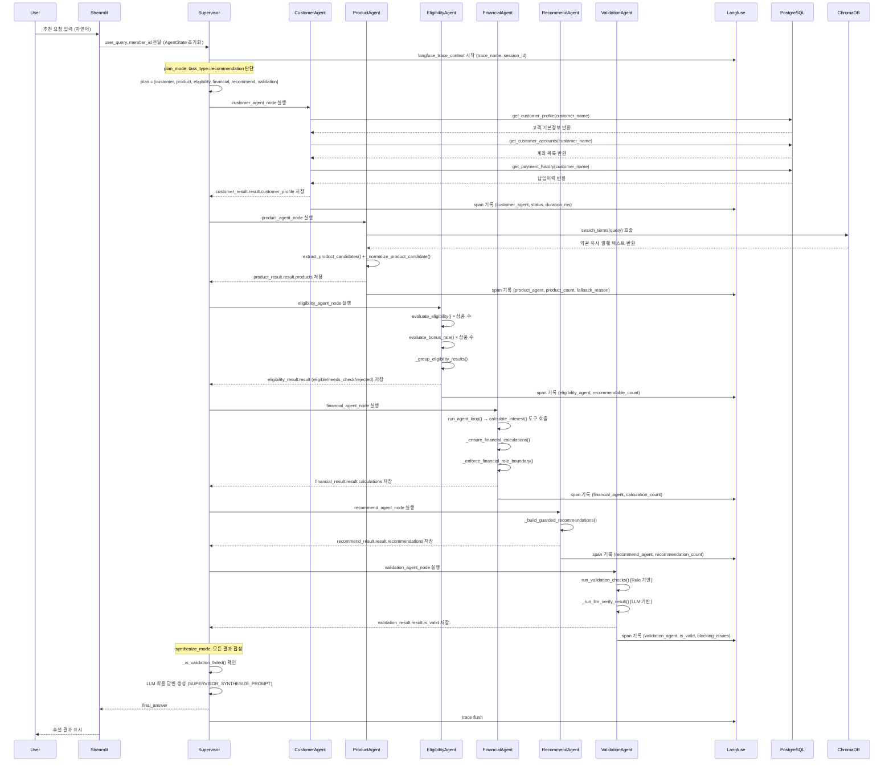
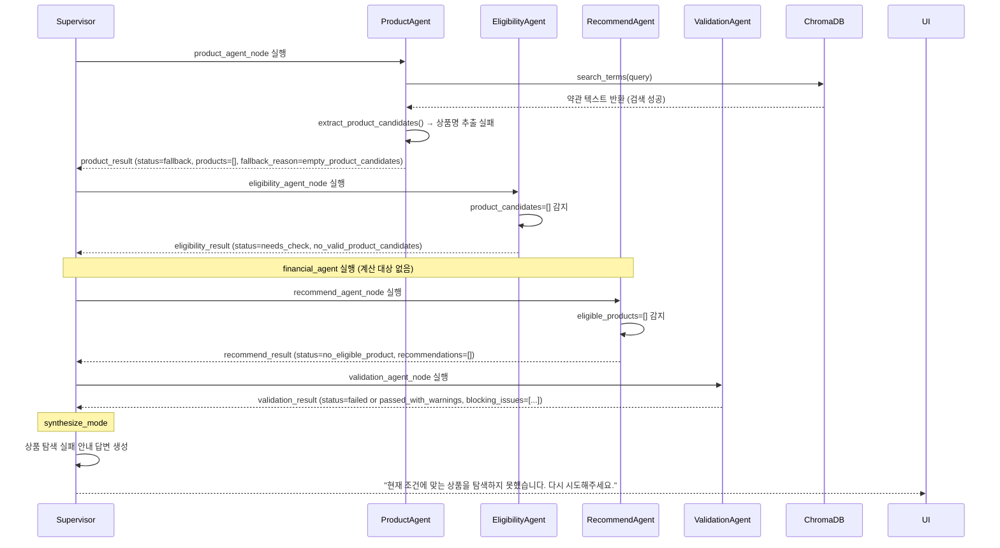
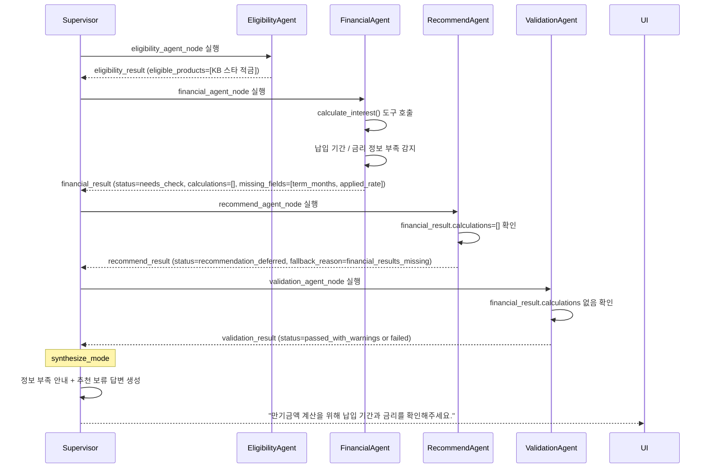
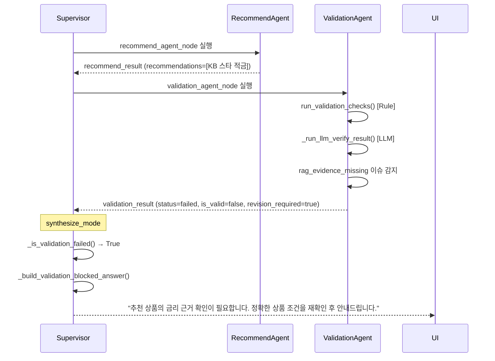

# PoCaT Agent 실행 순서 설계문서

> **현재 구현 기준** (2026-06-20)
> 현재 구현은 agent 간 직접 통신(A2A)이 아니라, **Supervisor 통제형 LangGraph 순차 실행**입니다.
> 각 agent는 shared state에 결과를 저장하고, 다음 agent가 이를 읽는 방식으로 협력합니다.

---

## 1. 기본 추천 흐름

### Sequence Diagram



---

## 2. 예외 흐름

### A. RAG 검색 실패 / 상품 추출 실패

Product Agent가 RAG 도구를 호출했지만 상품 파싱에 실패하는 경우:



---

### B. financial_result.calculations 누락

EligibilityAgent는 정상 실행되었지만 FinancialAgent가 필요 정보 부족으로 계산 실패하는 경우:



---

### C. Validation 실패

Recommend Agent는 추천 목록을 생성했지만 Validation Agent가 이를 실패 판정하는 경우:



---

## 3. LangGraph 라우팅 메커니즘

```
supervisor_node (plan_mode)
    ↓ _supervisor_router()
    ├─ task_type=casual → supervisor_node (synthesize) → END
    └─ 첫 agent 이름 → customer_agent_node
                            ↓ _route_after("customer_agent")
                            ├─ plan에 다음 agent 있으면 → 다음 agent
                            └─ 없으면 → supervisor_node (synthesize) → END
```

`_route_after(current_node)` 함수는 `state["plan"]`에서 현재 이후의 다음 agent를 찾아 반환합니다.

---

## 4. Langfuse Trace 구조

```
[Trace] pocat_recommendation
    ├─ [Span] supervisor (plan_mode)
    │      metadata: {task_type, plan, next, message_count}
    ├─ [Span] customer_agent
    │      metadata: {agent_name, status, tool_count, tool_names, duration_ms}
    ├─ [Span] product_agent
    │      metadata: {agent_name, status, search_query, rag_result_count,
    │                 product_count, structured_product_count,
    │                 structured_product_names, fallback_reason, duration_ms}
    ├─ [Span] eligibility_agent
    │      metadata: {agent_name, status, result_count, recommendable_count,
    │                 needs_check_count, rejected_count, duration_ms}
    ├─ [Span] financial_agent
    │      metadata: {agent_name, status, calculation_count,
    │                 missing_fields, fallback_reason, duration_ms}
    ├─ [Span] recommend_agent
    │      metadata: {agent_name, status, recommendation_count,
    │                 excluded_count, fallback_reason, duration_ms}
    ├─ [Span] validation_agent
    │      metadata: {agent_name, status, is_valid, revision_required,
    │                 blocking_issue_count, warning_count, duration_ms}
    └─ [Span] supervisor (synthesize_mode)
           metadata: {validation_blocked, final_answer_length, duration_ms}
```

각 agent가 Langfuse에 기록하는 metadata 기준:

| 필드 | 설명 |
|------|------|
| `agent_name` | agent 식별자 |
| `status` | success / fallback / needs_check / failed |
| `result_key` | state에 저장되는 result 키 이름 |
| `fallback_reason` | fallback 사유 (없으면 null) |
| `input_source` | 어떤 state 키를 읽었는지 |
| `tool_count` | 도구 호출 횟수 |
| `tool_error_count` | 도구 오류 횟수 |
| `duration_ms` | agent 실행 시간(ms) |
| `input_preview` | 입력 요약 (200자 이내) |
| `output_preview` | 출력 요약 (200자 이내) |

> state 전체나 대용량 텍스트는 metadata에 포함하지 않습니다.

---

## 5. Task Type별 실행 Agent 순서

| Task Type | 실행 순서 |
|-----------|-----------|
| casual | supervisor만 (직접 응답) |
| customer_lookup | customer |
| product_info | product |
| financial_analysis | customer → financial → validation |
| eligibility_check | customer → product → eligibility → validation |
| **recommendation** | **customer → product → eligibility → financial → recommend → validation** |
| early_termination | customer → product → financial → recommend → validation |
| switch_analysis | customer → financial → product → eligibility → recommend → validation |

---

## 6. 현재 구현상 주의사항

1. **순차 실행, A2A 아님**: 현재 구현은 agent 간 직접 통신이 없습니다. Supervisor가 계획(`plan`)을 수립하면 LangGraph가 순서대로 agent를 실행하고, 각 agent는 shared state를 읽고 씁니다.

2. **Shared State 기반 데이터 전달**: Product Agent의 결과(`product_result`)를 Eligibility Agent가 state에서 직접 읽습니다. 별도 메시지 패싱이나 큐가 없습니다.

3. **Supervisor 2회 실행**: Supervisor는 plan_mode(계획 수립)와 synthesize_mode(최종 답변 합성) 두 번 실행됩니다. 그래프에서 같은 노드를 두 번 진입합니다.

4. **LLM 검증 조건부 실행**: Validation Agent의 LLM 검증은 복잡한 task_type(`recommendation`, `financial_analysis` 등)에서만 실행되며, 단순 조회(`customer_lookup`, `casual`)는 Rule 검증만 실행합니다.

5. **Langfuse 비활성화 시 영향 없음**: `.env`에 Langfuse 키가 없으면 모든 trace 호출이 자동으로 no-op 처리되며 시스템 동작에 영향이 없습니다.

---

## 확인한 주요 코드 위치

- [app.py](../app.py) — 그래프 실행 진입점, session_id 관리
- [graph/builder.py](../graph/builder.py) — `_supervisor_router()`, `_route_after()`, 노드 등록
- [graph/state.py](../graph/state.py) — AgentState TypedDict
- [agents/supervisor/agent.py](../agents/supervisor/agent.py) — `_plan_mode()`, `_synthesize_mode()`, `_is_validation_failed()`
- [agents/base.py](../agents/base.py) — `run_agent_loop()` (공통 LLM 루프)
- [agents/customer/agent.py](../agents/customer/agent.py)
- [agents/product/agent.py](../agents/product/agent.py) — `_determine_fallback_reason()`
- [agents/eligibility/agent.py](../agents/eligibility/agent.py) — `_build_guarded_eligibility_results()`
- [agents/financial/agent.py](../agents/financial/agent.py) — `_ensure_financial_calculations()`, `_enforce_financial_role_boundary()`
- [agents/recommend/agent.py](../agents/recommend/agent.py) — `_build_guarded_recommendations()`
- [agents/validation/agent.py](../agents/validation/agent.py) — `run_validation_checks()`, `_run_llm_verify_result()`
- [observability/langfuse.py](../observability/langfuse.py) — `langfuse_observation()`, `update_observation()`
