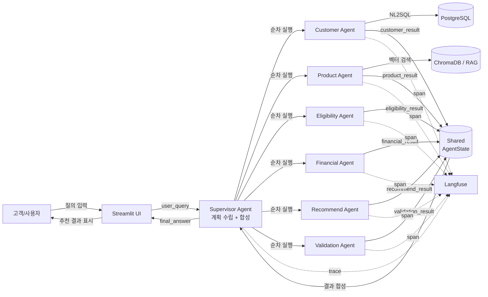

# PoCaT 유스케이스 설계문서

> **현재 구현 기준** (2026-06-20)
> README에 "A2A"로 표현된 부분도 실제 구현은 LangGraph shared-state 기반 순차 실행입니다.
> 각 agent는 `AgentState`의 `{agent}_result` 키에 결과를 저장하고, 후속 agent가 이를 참조합니다.
> 별도 A2A 서버는 내부 agent 간 직접 통신이 아니라 외부 client 검증용 인터페이스입니다.

---

## 1. 시스템 개요

PoCaT(Proof of Concept — AI Teller)은 고객 정보·우대조건·월 저축 가능액을 기반으로 예·적금 상품을 추천하는 **멀티 에이전트 금융상품 추천 시스템**입니다.

단순 상품 나열이 아니라 아래 단계를 거쳐 근거 있는 추천을 제공합니다.

```
고객 조건 파악 → 상품 후보 탐색 → 가입 가능 여부 판단
    → 예상 금액 계산 → 최종 추천 → 결과 검증
```

- **데이터**: 고객 정보(PostgreSQL), 상품 약관(ChromaDB RAG)
- **AI 엔진**: LangGraph 기반 Supervisor 통제형 순차 실행
- **관측**: Langfuse trace(선택 활성화)

---

## 2. 주요 액터

| 액터 | 유형 | 설명 |
|------|------|------|
| 고객/사용자 | External | Streamlit UI로 질의를 입력하는 실제 사람 |
| Streamlit UI | System | 사용자 입력 수신 및 최종 답변 표시 (`app.py`) |
| Supervisor Agent | Internal | 실행 계획 수립, 에이전트 순서 제어, 최종 답변 합성 |
| Customer Agent | Internal | 고객 기본정보·계좌·납입이력 조회 |
| Product Agent | Internal | RAG 기반 상품 약관 검색 및 상품 후보 추출 |
| Eligibility Agent | Internal | 고객 조건 대비 가입 가능 여부 판단 |
| Financial Agent | Internal | 이자·만기금액·갈아타기 손익 계산 |
| Recommend Agent | Internal | 우선순위 추천 목록 생성 |
| Validation Agent | Internal | Rule + LLM 이중 검증 |
| PostgreSQL / NL2SQL | External | 고객 정보 저장소 (psycopg2 직접 연결) |
| RAG / ChromaDB | External | 상품 약관 벡터 검색 (HuggingFace Embeddings) |
| Langfuse | External | Agent 실행 trace 관측 (선택 활성화) |

---

## 3. 핵심 유스케이스

### UC-01 고객이 예·적금 추천을 요청한다

| 항목 | 내용 |
|------|------|
| **Usecase ID** | UC-01 |
| **Usecase Name** | 금융상품 추천 요청 |
| **Primary Actor** | 고객/사용자 |
| **Precondition** | Streamlit 앱이 실행 중이고, 고객 ID(member_id)가 URL 파라미터 또는 세션에 존재한다 |
| **Main Flow** | 1. 사용자가 Streamlit 채팅창에 추천 요청 입력<br>2. app.py가 `user_query`를 추출하고 LangGraph 그래프를 실행<br>3. Supervisor가 `task_type=recommendation`으로 판단하고 실행 계획 수립<br>4. 6개 전문 에이전트가 순서대로 실행<br>5. Supervisor가 모든 결과를 합성해 최종 답변 생성<br>6. Streamlit UI가 답변 표시 |
| **Alternative Flow** | 질의가 일상 대화(task_type=casual)인 경우 Supervisor가 직접 응답 |
| **Exception Flow** | 필수 agent 결과 누락 시 Supervisor가 필요 정보 안내 답변 생성 |
| **Result** | 사용자가 자신의 조건에 맞는 예·적금 추천 목록과 예상 수령액을 확인한다 |
| **Related Agents** | Supervisor, Customer, Product, Eligibility, Financial, Recommend, Validation |

---

### UC-02 고객 정보를 조회한다

| 항목 | 내용 |
|------|------|
| **Usecase ID** | UC-02 |
| **Usecase Name** | 고객 정보 조회 |
| **Primary Actor** | Customer Agent |
| **Precondition** | `state.member_id` 또는 `state.customer_id`가 존재한다 |
| **Main Flow** | 1. Customer Agent가 `customer_id`를 추출<br>2. `get_customer_profile` 도구로 기본정보 조회<br>3. `get_customer_accounts` 도구로 계좌 목록 조회<br>4. `get_payment_history` 도구로 납입이력 조회<br>5. `_extract_customer_profile()`로 구조화된 프로필 생성<br>6. `customer_result.result.customer_profile`에 저장 |
| **Alternative Flow** | customer_id 없는 경우 LLM 에이전트 루프로 전환 |
| **Exception Flow** | DB 조회 실패 시 `status=failed`, `error` 필드에 원인 기록 |
| **Result** | shared state의 `customer_result`에 고객 프로필이 저장된다 |
| **Related Agents** | Customer Agent, PostgreSQL |

---

### UC-03 상품 후보를 검색한다

| 항목 | 내용 |
|------|------|
| **Usecase ID** | UC-03 |
| **Usecase Name** | 상품 후보 검색 |
| **Primary Actor** | Product Agent |
| **Precondition** | RAG(ChromaDB)가 초기화되어 있고 `search_terms` 도구가 등록되어 있다 |
| **Main Flow** | 1. Product Agent LLM이 `search_terms(query)` 도구를 호출<br>2. ChromaDB에서 유사 약관 발췌 반환<br>3. `extract_product_candidates_from_search_results()`로 상품 파싱<br>4. `_normalize_product_candidate()`로 표준 필드 정규화<br>5. `product_result.result.products`에 저장 |
| **Alternative Flow** | LLM이 도구를 호출하지 않으면 `fallback_reason=tool_not_called` |
| **Exception Flow** | RAG 비활성화: `fallback_reason=rag_disabled`<br>검색 결과 없음: `fallback_reason=no_search_results`<br>상품 파싱 실패: `fallback_reason=empty_product_candidates` |
| **Result** | `product_result.result.products`에 정규화된 상품 후보 목록이 저장된다 |
| **Related Agents** | Product Agent, ChromaDB |

---

### UC-04 가입 가능 여부를 판단한다

| 항목 | 내용 |
|------|------|
| **Usecase ID** | UC-04 |
| **Usecase Name** | 가입 가능 여부 판단 |
| **Primary Actor** | Eligibility Agent |
| **Precondition** | `customer_result.result.customer_profile`과 `product_result.result.products`가 존재한다 |
| **Main Flow** | 1. 고객 프로필, 계좌 목록, 상품 후보 로드<br>2. 각 상품별 `evaluate_eligibility()` 실행<br>3. 우대조건 충족 여부 `evaluate_bonus_rate()` 실행<br>4. 결과를 eligible / needs_check / rejected / invalid_product로 분류<br>5. `eligibility_result.result`에 그룹별 목록 저장 |
| **Alternative Flow** | 상품 후보 없음 → needs_check 전체 반환<br>프로필 필드 부족 → eligible → needs_check로 하향 |
| **Exception Flow** | 상품명이 비정상(본문 문장)인 경우 invalid_product로 분류 |
| **Result** | 각 상품별 가입 가능 여부와 우대조건 충족 여부가 분류된다 |
| **Related Agents** | Eligibility Agent |

---

### UC-05 예상 이자/만기금액을 계산한다

| 항목 | 내용 |
|------|------|
| **Usecase ID** | UC-05 |
| **Usecase Name** | 예상 금액 계산 |
| **Primary Actor** | Financial Agent |
| **Precondition** | 상품 금리, 납입 기간, 금액 정보가 상태에 존재한다 |
| **Main Flow** | 1. LLM이 `calculate_interest()` 도구 호출<br>2. 납입 방식(적금/예금)에 따라 이자 계산<br>3. `_ensure_financial_calculations()`로 calculations 필드 파싱<br>4. `financial_result.result.calculations`에 리스트로 저장 |
| **Alternative Flow** | 갈아타기 분석: `compare_switch_benefit()` 추가 호출<br>만기 키워드 감지: `estimate_active_account_maturity()` 자동 호출 |
| **Exception Flow** | 계산 필드 부족 시 `status=needs_check`, `missing_fields` 기록<br>추천성 문장이 포함된 경우 `_enforce_financial_role_boundary()`로 제거 |
| **Result** | `financial_result.result.calculations`에 상품별 예상 수령액이 저장된다 |
| **Related Agents** | Financial Agent |

---

### UC-06 최종 추천 결과를 생성한다

| 항목 | 내용 |
|------|------|
| **Usecase ID** | UC-06 |
| **Usecase Name** | 최종 추천 생성 |
| **Primary Actor** | Recommend Agent |
| **Precondition** | eligibility_result, financial_result가 모두 존재한다 |
| **Main Flow** | 1. eligible_products, calculations, product_candidates 로드<br>2. `_build_guarded_recommendations()`로 추천 목록 생성<br>3. 순위(rank), 추천 사유, 예상 수령액, 경고 포함<br>4. `recommend_result.result.recommendations`에 저장 |
| **Alternative Flow** | needs_check 상품만 있는 경우 → 추천 포함하되 경고 명시 |
| **Exception Flow** | eligibility 결과 없음: `needs_more_info`<br>financial 결과 없음: `recommendation_deferred`<br>eligible 상품 없음: `no_eligible_product` |
| **Result** | 순위가 매겨진 추천 목록과 제외 사유가 저장된다 |
| **Related Agents** | Recommend Agent |

---

### UC-07 추천 결과를 검증한다

| 항목 | 내용 |
|------|------|
| **Usecase ID** | UC-07 |
| **Usecase Name** | 결과 검증 |
| **Primary Actor** | Validation Agent |
| **Precondition** | 모든 이전 agent 결과가 shared state에 존재한다 |
| **Main Flow** | 1. Rule 기반 검증 항목 실행 (5개 공통 체크)<br>2. 복잡한 task_type이면 LLM 검증 추가 실행<br>3. is_valid, blocking_issues, warnings 판단<br>4. `validation_result`에 저장<br>5. Supervisor가 `_is_validation_failed()` 확인 후 답변 결정 |
| **Alternative Flow** | customer_lookup, product_info, casual → Rule 검증만 실행 |
| **Exception Flow** | 검증 실패 → Supervisor가 확정 추천 차단, 필요 정보 안내 생성 |
| **Result** | 추천 결과의 신뢰도가 검증되고, 문제 있으면 revision_required=True |
| **Related Agents** | Validation Agent, Supervisor |

---

### UC-08 오류/누락 발생 시 fallback 답변을 제공한다

| 항목 | 내용 |
|------|------|
| **Usecase ID** | UC-08 |
| **Usecase Name** | Fallback 답변 제공 |
| **Primary Actor** | Supervisor Agent |
| **Precondition** | 하나 이상의 agent가 오류 또는 needs_check 반환 |
| **Main Flow** | 1. Supervisor synthesize 단계에서 validation_result 확인<br>2. `_is_validation_failed()` 판단<br>3. `_build_validation_blocked_answer()`로 fallback 안내 생성<br>4. 부족한 정보, 필요한 추가 질의 안내 |
| **Alternative Flow** | 경고(warnings)만 있는 경우 → passed_with_warnings로 추천 포함 |
| **Exception Flow** | 모든 agent 실패 시 → 시스템 오류 안내 |
| **Result** | 사용자가 왜 추천이 불가능한지 이해하고 추가 정보를 제공할 수 있다 |
| **Related Agents** | Supervisor, Validation |

---

### UC-09 Langfuse로 agent 실행 trace를 확인한다

| 항목 | 내용 |
|------|------|
| **Usecase ID** | UC-09 |
| **Usecase Name** | Agent 실행 Trace 관측 |
| **Primary Actor** | 운영자/개발자 |
| **Precondition** | `.env`에 `LANGFUSE_PUBLIC_KEY`, `LANGFUSE_SECRET_KEY`가 설정되어 있다 |
| **Main Flow** | 1. 세션 시작 시 `langfuse_trace_context()`로 최상위 trace 생성<br>2. 각 agent 실행 시 `langfuse_observation()`으로 span 기록<br>3. `update_observation()`으로 input/output/metadata 업데이트<br>4. Langfuse 대시보드에서 agent별 실행 시간·오류 확인 |
| **Alternative Flow** | LANGFUSE 키 미설정 시 → trace 비활성화, 시스템은 정상 작동 |
| **Exception Flow** | Langfuse 서버 연결 실패 → `_LANGFUSE_INIT_FAILED=True`, 이후 무시 |
| **Result** | agent별 실행 span, fallback_reason, duration_ms를 대시보드에서 확인 가능 |
| **Related Agents** | 전체 agent, Langfuse |

---

## 4. 유스케이스 다이어그램



---

## 5. 예외 흐름 상세

| 예외 상황 | 발생 위치 | 처리 방식 |
|-----------|-----------|-----------|
| DB 조회 실패 | Customer Agent | `status=failed`, `error` 기록, LLM 루프로 fallback |
| RAG 검색 실패 | Product Agent | `fallback_reason=no_search_results`, `products=[]` |
| 상품명 추출 실패 | Product Agent | `fallback_reason=empty_product_candidates` |
| embedding dimension mismatch | ChromaDB | 예외 캐치 후 `tool_result`에 오류 텍스트 반환 |
| customer_profile 누락 | Eligibility Agent | eligible → needs_check 하향 처리 |
| financial_result.calculations 누락 | Recommend Agent | `recommendation_deferred`, `fallback_reason=financial_results_missing` |
| Validation 실패 | Supervisor synthesize | `_build_validation_blocked_answer()` 호출, 확정 추천 차단 |
| 상품명 비정상(본문 문장) | Eligibility Agent | `invalid_product`로 분류, Recommend Agent 제외 처리 |

---

## 확인한 주요 코드 위치

- [app.py](../app.py) — Streamlit UI, 그래프 실행 진입점
- [graph/builder.py](../graph/builder.py) — LangGraph 노드 등록 및 라우팅
- [graph/state.py](../graph/state.py) — AgentState TypedDict 정의
- [agents/supervisor/agent.py](../agents/supervisor/agent.py) — plan_mode, synthesize_mode, task_type 라우팅
- [agents/customer/agent.py](../agents/customer/agent.py) — 고객 조회, NL2SQL 도구 호출
- [agents/customer/tools.py](../agents/customer/tools.py) — get_customer_profile, get_customer_accounts, get_payment_history
- [agents/product/agent.py](../agents/product/agent.py) — RAG 검색, 상품 파싱, fallback 판단
- [agents/product/tools.py](../agents/product/tools.py) — search_terms (RAG)
- [agents/eligibility/agent.py](../agents/eligibility/agent.py) — 가입 가능 여부 판단, 그룹화
- [agents/financial/agent.py](../agents/financial/agent.py) — 계산 루프, role boundary 강제
- [agents/recommend/agent.py](../agents/recommend/agent.py) — 추천 생성, fallback 로직
- [agents/validation/agent.py](../agents/validation/agent.py) — Rule + LLM 이중 검증
- [agents/base.py](../agents/base.py) — run_agent_loop 공통 루프
- [db/postgres_db.py](../db/postgres_db.py) — PostgreSQL 직접 연결
- [db/vectorstore.py](../db/vectorstore.py) — ChromaDB 초기화
- [mcp_servers/postgres_mcp_server.py](../mcp_servers/postgres_mcp_server.py) — MCP Tool 노출
- [observability/langfuse.py](../observability/langfuse.py) — Trace, span, metadata 기록
