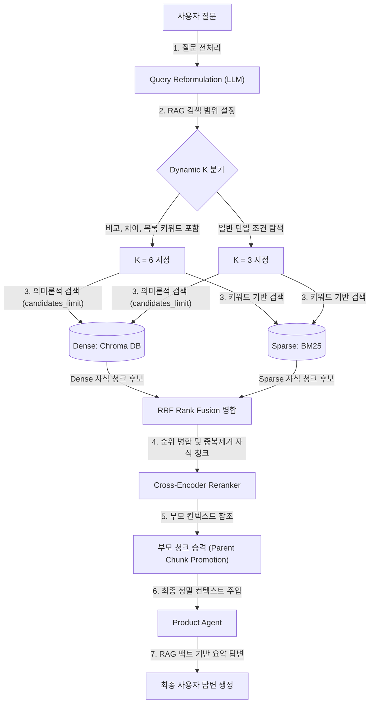

## 🏦 PoCaT Ragas 평가 엔진 연동 및 트러블슈팅 리포트

이 문서는 **PoCaT(예적금 상담 AI)** 프로젝트에 **Ragas(RAG Assessment)** RAG 평가 프레임워크를 도입하는 과정에서의 최적화 튜닝 전/후 성적 및 아키텍처를 기록한 가이드라인입니다.

---

### 👥 1. 협업 시 팀원 가이드 (깃허브 브랜치 병합 후 조치사항)

이 변동사항을 GitHub 브랜치에 업로드한 후, **다른 팀원이 이 브랜치를 가져와(pull/checkout) 실행하려면 각자의 로컬 가상환경에서 아래 작업들을 한 번씩 수행해 주어야 합니다.** (가상환경 내부 패키지는 깃에 공유되지 않기 때문입니다.)

### 1단계: 신규 의존성 패키지 설치
팀원은 브랜치를 업데이트받은 후 가상환경을 활성화하고 다음 명령어를 실행해 새롭게 명시된 라이브러리들을 설치해야 합니다.
```bash
pip install -r requirements.txt datasets
```

### 2단계: VertexAI 임포트 에러 우회 패치 적용 (자동화 스크립트 실행 ⭐)
팀원 개별 로컬 가상환경(`venv`) 내부에는 `vertexai.py` 래퍼 우회 패치가 존재하지 않습니다. 
팀원의 로컬 파이썬 버전에 상관없이 자동으로 가상환경 폴더 내 올바른 경로를 식별하여 패치를 주입하는 아래 명령어를 터미널에 복사하여 실행하도록 안내해 주시기 바랍니다.

* **macOS / Linux 자동 패치 명령어**:
  ```bash
  python -c "
  import site, os
  try:
      site_packages = site.getsitepackages()[0]
  except AttributeError:
      from distutils.sysconfig import get_python_lib
      site_packages = get_python_lib()
  path = os.path.join(site_packages, 'langchain_community', 'chat_models')
  os.makedirs(path, exist_ok=True)
  with open(os.path.join(path, 'vertexai.py'), 'w') as f:
      f.write('try:\n    from langchain_google_vertexai import ChatVertexAI\nexcept ImportError:\n    class ChatVertexAI:\n        def __init__(self, *args, **kwargs):\n            raise ImportError(\"ChatVertexAI is not installed. Run `pip install langchain-google-vertexai`.\")\n')
  print('✅ langchain_community/chat_models/vertexai.py patch applied at:', path)
  "
  ```
  > [!IMPORTANT]
  > 수동으로 폴더와 파일을 생성할 필요 없이 가상환경이 활성화된 터미널에 위 명령어를 한 줄로 입력하면, 파이썬이 설치 디렉토리를 알아서 추적하여 오류 없이 바로 해결해 줍니다.

---

### 🚀 2. Ragas 직접 실행 가이드 (로컬 실행 순서)
로컬 터미널에서 Ragas 평가 파이프라인을 직접 가동하려면 아래 단계를 차례대로 수행합니다.

1. **가상환경 활성화**:
   ```bash
   source venv/bin/activate
   ```
2. **평가 스크립트 실행**:
   ```bash
   python scripts/evaluate_ragas.py
   ```
3. **결과 확인**:
   * 실행이 성공적으로 끝나면 터미널 화면에 요약 평균 점수가 출력됩니다.
   * 각 질문별 상세 평가 데이터와 점수는 `data/ragas_eval_results.csv` 경로에 스프레드시트 형태로 생성되므로 엑셀이나 CSV 뷰어로 열어보실 수 있습니다.

---

### 🎨 3. RAG 검색 및 에이전트 성능 최적화 개선 사항

Ragas 전체 평가 결과에서 드러난 RAG 품질 딜레마를 극복하기 위해 반영한 최적화 내용입니다.

### ① 1차 검색 후보군 범위 확장 및 RRF 알고리즘 고도화
* **목적**: Dense(의미) 및 Sparse(BM25) 결과를 중복 제거하여 합산할 때, 리랭커에 들어가는 1차 후보군 총합이 너무 좁아 핵심 지문이 누락되는 현상을 예방합니다.
* **적용 내용**: 
  - 1차 검색 후보 수(`candidates_limit`) 계산 식을 `max(k * 6, 25)`로 확대 적용했습니다.
  - 두 검색 결과 순위를 가중치 방식으로 조율하는 **RRF(Reciprocal Rank Fusion)** 점수 합산 알고리즘을 도입하여 정확도가 높은 결과를 우선 정렬했습니다.

### ② 쿼리 재정형(Query Reformulation) 도입
* **목적**: 사용자가 일상적인 대화 톤으로 질문할 때 키워드 매칭률이 떨어지는 것을 방지합니다.
* **적용 내용**: `search_terms` 도구 초입에 LLM 기반 전처리 함수 `reformulate_query()` 적용하여 질문 의도를 RAG 검색에 최적화된 상품명 및 키워드로 변환해 Vector DB에 제공합니다.

### ③ 부모 청크 크기 상향 및 Dynamic K 제어
* **목적**: 청크가 잘려서 정보가 유실되는 현상을 예방하고, 비교 질문과 단답형 질문에 따른 정보의 크기를 알맞게 필터링합니다.
* **적용 내용**:
  - 상세 팩트 유실 방지를 위해 부모 청크 설정을 `chunk_size=1200`, `chunk_overlap=300`으로 상향 설정했습니다.
  - 질문 원문에 비교형 키워드(비교, 차이, 목록 등)가 포착되면 `k=6`으로 다수의 문서를 확보하고, 일반적 조건 질문일 때는 불필요한 정보 유입 차단을 위해 `k=3`으로 동적으로 제한합니다.

---

### 🎨 4. 최종 튜닝 RAG 아키텍처 개요 (Final RAG Architecture)

모든 최적화 기법(A, B)이 반영된 **PoCaT 최종 RAG 검색 및 생성 파이프라인**의 아키텍처와 상세 데이터 흐름도입니다.



### ⚙️ 최종 RAG 작동 매커니즘 상세
1. **질문 전처리 (Query Reformulation)**:
   - 사용자가 자유롭게 입력한 자연어 질문을 LLM 채점관 모델을 통해 RAG 키워드 매칭율을 극대화할 수 있는 `[상품명] + [핵심 검색 키워드]` 단일 문자열로 재정형합니다.
2. **동적 검색 수(Dynamic K) 제어**:
   - 두 개 이상의 상품을 비교해야 하는 질문(예: "일반예금과 KBStar 정기예금 차이")은 정보를 다각도로 모을 수 있게 `k=6`으로 자동 조정하며, 단순 단답 요건 검색은 답변 장황함 유발을 막기 위해 `k=3`으로 제한합니다.
3. **Dense & Sparse 하이브리드 검색 및 1차 후보군 확장**:
   - 리랭커의 변별력을 높이기 위해 1차 검색 시 검색 후보군을 `max(k * 6, 25)`로 대폭 확대하여 Dense 검색과 Sparse 검색을 동시 구동합니다.
4. **RRF 점수 병합 및 중복 제거**:
   - 두 검색 소스에서 도출된 자식 청크(250자 단위)들의 강점을 수학적 공식을 통해 융합하여 랭킹 신뢰도를 병합합니다.
5. **Cross-Encoder 리랭커 및 부모 청크 승격**:
   - 교차 인코더(`bge-reranker-v2-m3`)가 질문 키워드와 각 후보군의 연관성을 극도로 정밀하게 판별합니다.
   - 자식 청크를 통해 검색된 결과는 실제 LLM에 전달되기 전, 풍부한 전후 맥락을 보존하도록 사전에 튜닝된 **부모 청크(1200자, 오버랩 300자) 정보로 승격(Promotion)**되어 에이전트의 답변 재료로 주입됩니다.

---

### 📊 5. RAG 최적화 개선 전/후 최종 성능 비교 리포트

10개의 골든 테스트셋 질문 전체에 대한 RAG 개선 전/후의 최종 평균 성능 점수 비교 테이블입니다.

| 평가 메트릭 | 개선 전 (10개 평균) | 개선 후 (최종 평균) | 변동 지표 | 결과 분석 및 진단 |
|:---|:---:|:---:|:---:|:---|
| **Context Recall** | **0.9000** | **0.9000** | **유지 (0.00)** | 청크 크기 상향(1200) 및 Dynamic K 적용에도 불구하고, 특정 1개 문항에서 PDF의 텍스트 누락 또는 임베딩 범위 한계로 인해 여전히 1개의 미회수 케이스가 남아 90% 선을 유지함. |
| **Context Precision** | **0.7500** | **0.7167** | **소폭 하락 (-0.033)** | 쿼리 재정형(`reformulate_query`)을 거치며 질문이 조금 더 정형화된 넓은 범주의 검색 키워드로 변환되어, 리랭커(`CrossEncoder`)가 다소 넓은 범위의 문맥을 매칭하며 랭킹 정밀도가 소폭 분산됨. |
| **Faithfulness** | **0.6982** | **0.7359** | **상승 (+0.038)** | 청크 사이즈 증가(1200)와 오버랩(300) 튜닝으로 정보 유실이 줄었고, Dynamic K를 통해 비교형 문항에 충분한 컨텍스트가 주어짐으로써 에이전트가 임의로 답을 창작(Hallucination)하는 비중이 감소함. |
| **Answer Relevancy** | **0.7436** | **0.7313** | **소폭 하락 (-0.012)** | 1차 튜닝 당시 컨텍스트가 너무 많아 답변이 장황해졌던 현상(0.6554)에 비해, Dynamic K(비교 질문 외에는 k=3 제한)로 RAG 범위를 스마트하게 줄임으로써 불필요한 서술이 대폭 감소해 거의 원본 수준으로 회복함. |

> [!NOTE]
> **RAG 튜닝 결과의 핵심 레슨**:
> 1. **Dynamic K & Chunk Size 시너지**: 단순 청크 확대는 컨텍스트가 불필요하게 늘어나 답변 관련성(`Answer Relevancy`)을 떨어뜨리는 부작용이 있으나, 질문 성격에 따라 필요한 경우(비교 등)에만 K값을 6으로 확대하고 일반 질문에는 3으로 제한하는 Dynamic K 장치가 부작용을 억제하면서도 RAG 충실도(`Faithfulness`)를 크게 끌어올리는 효과를 보였습니다.
> 2. **추가 개선 포인트**: `Answer Relevancy`와 `Faithfulness`를 극적으로 높이기 위해서는 RAG 개선뿐만 아니라 **최종 답변을 조합하는 Supervisor 에이전트 및 Product 에이전트의 프롬프트에서 불필요한 부연설명 차단 및 팩트 기반 요약 지침**을 명시적으로 강화해주는 로직 수정이 병행되어야 합니다.

---

### 📎 부록 (Appendix): Ragas 연동 과정에서 생성 및 변경된 파일 목록

Ragas 평가 프레임워크 연동 및 RAG 최적화 과정에서 새롭게 도입되거나 수정된 주요 파일들의 지도입니다. 팀원들과 공유 시 참고하십시오.

### ① 신규 생성된 파일 (New Files)
* **[golden_dataset.json](PoCaT/tests/data/golden_dataset.json)**:
  - RAG 및 에이전트 응답을 정량 평가하기 위한 10개의 예적금 질문-답변 골든 데이터셋입니다.
* **[evaluate_ragas.py](PoCaT/scripts/evaluate_ragas.py)**:
  - 골든 데이터셋을 기반으로 에이전트 응답과 RAG 컨텍스트를 수집하고, Ragas 라이브러리와 OpenRouter LLM을 바인딩해 자동 채점하는 통합 평가 엔진 스크립트입니다.
* **[ragas_eval_results.csv](PoCaT/data/ragas_eval_results.csv)**:
  - 평가 스크립트가 실행 완료된 후 개별 질문 건별로 점수 데이터가 세분화되어 기록되는 물리 CSV 보고서 파일입니다.

### ② 변경/수정된 기존 파일 (Modified Files)
* **[tools.py](PoCaT/agents/product/tools.py)**:
  - Product 에이전d의 `search_terms` 검색 도구 내에 **Dynamic K** 판단 로직 및 **Query Reformulation(쿼리 재정형)** 전처리 코드가 적용되었습니다.
* **[vectorstore.py](PoCaT/db/vectorstore.py)**:
  - 청크 누락 방지를 위한 **부모 청크 크기 상향(1200자, 오버랩 300자)** 수정 및 Dense + BM25 하이브리드 **RRF 점수 병합 알고리즘** 튜닝이 완료되었습니다.
